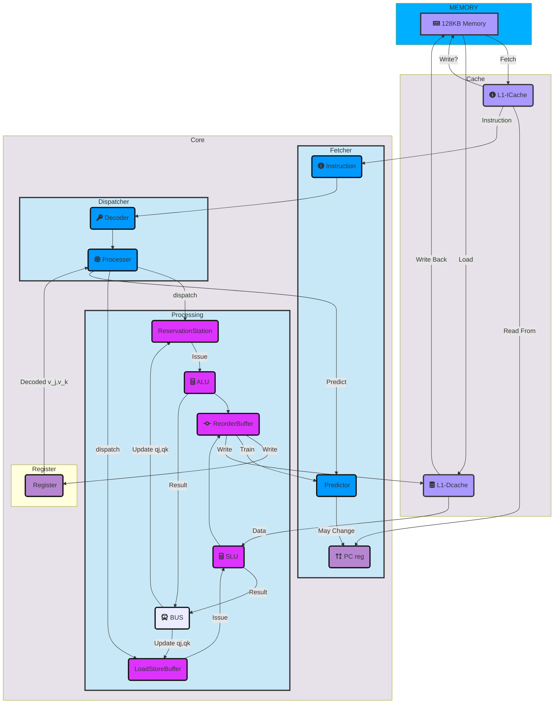

## A Simplified RISCV-CPU Design
<link rel="stylesheet" href="https://cdnjs.cloudflare.com/ajax/libs/font-awesome/6.2.0/css/all.min.css">

## 目前保证正确运行：
定义正确运行：在能接受的时间内停机并输出正确结果

sim中所有的小样例

大样例中Queens,hanoi,bulgarian能在可接受的时间输出前面部分答案

## CPU架构图

