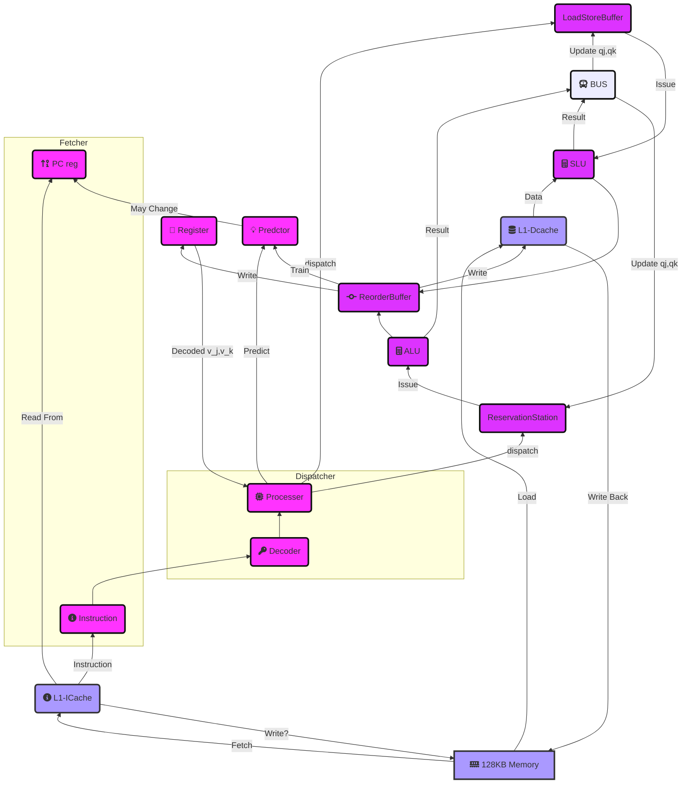

## A Simplified RISCV-CPU Design
<link rel="stylesheet" href="https://cdnjs.cloudflare.com/ajax/libs/font-awesome/6.2.0/css/all.min.css">

```mermaid

graph BT
    classDef Memory fill:#a9f,stroke:#333,stroke-width:3px;
    
    classDef Process fill:#p3f,stroke:#111,stroke-width:3px;

    classDef Station fill:#d3f,stroke:#111,stroke-width:3px;

    classDef Unit fill:#f3f,stroke:#111,stroke-width:3px;

    classDef Transfer fill:#p3f,stroke:#111,stroke-width:3px;

    Mem[fa:fa-memory 128KB Memory]
    IC(fa:fa-circle-info L1-ICache)
    DC(fa:fa-database L1-Dcache)
    class IC,DC,Mem Memory;
    click Mem,IC,DC "https://www.github.com"
    Reg(🧮 Register)
    Prdt(💡 Predctor)
    subgraph Fetcher
      PC(fa:fa-arrow-up-9-1 PC reg)
      Inst(fa:fa-circle-info Instruction)
    end
    subgraph Dispatcher
      decode(fa:fa-key Decoder)
      Process(fa:fa-microchip Processer)
    end
    class Reg,Inst,PC,decode,Process,Prdt Unit
    LSB(LoadStoreBuffer)
    RS(ReservationStation)
    ALU(fa:fa-calculator ALU)
    SLU(fa:fa-calculator SLU)
    BUS(fa:fa-bus BUS)
    ROB(fa:fa-code-commit  ReorderBuffer)
    class ALU,SLU,ROB,RS,LSB Station
    class BUS Transfer
    Mem -->|Fetch| IC
    IC  -->|Write?| Mem
    Mem -->|Load| DC
    DC  -->|Write Back| Mem
    IC  -->|Read From| PC
    IC  -->|Instruction| Inst
    Inst--> decode
    decode--> Process
    Process-->|dispatch|RS
    Process-->|dispatch|LSB
    Process-->|Predict|Prdt
    Prdt-->|May Change|PC
    Reg-->|Decoded v_j,v_k|Process
    RS-->|Issue|ALU
    LSB-->|Issue|SLU
    DC-->|Data|SLU
    ALU-->ROB
    SLU-->ROB
    ALU-->|Result|BUS
    SLU-->|Result|BUS
    BUS-->|Update qj,qk|RS
    BUS-->|Update qj,qk|LSB
    ROB-->|Write|Reg
    ROB-->|Train|Prdt
    ROB-->|Write|DC
```